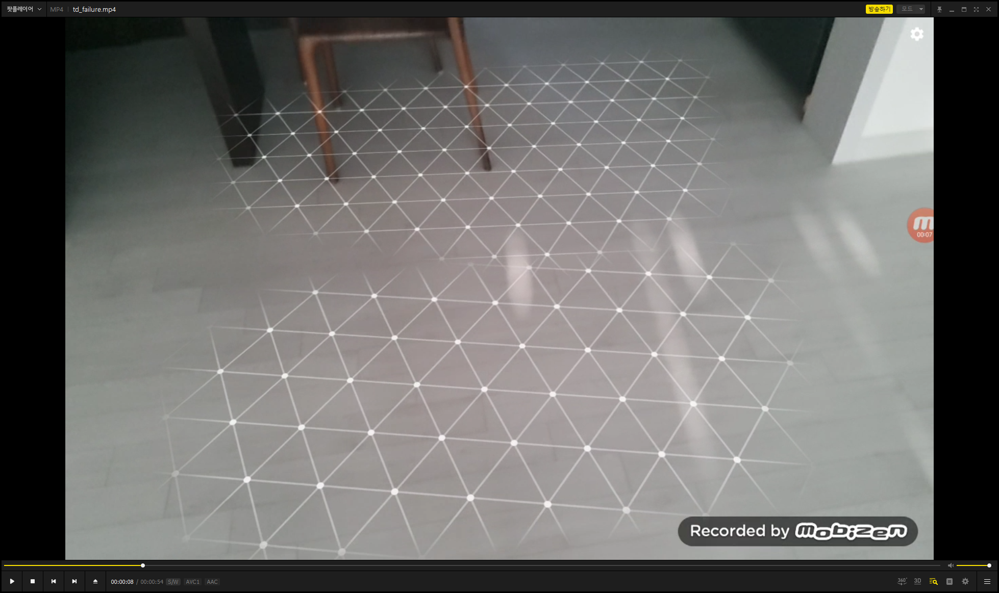
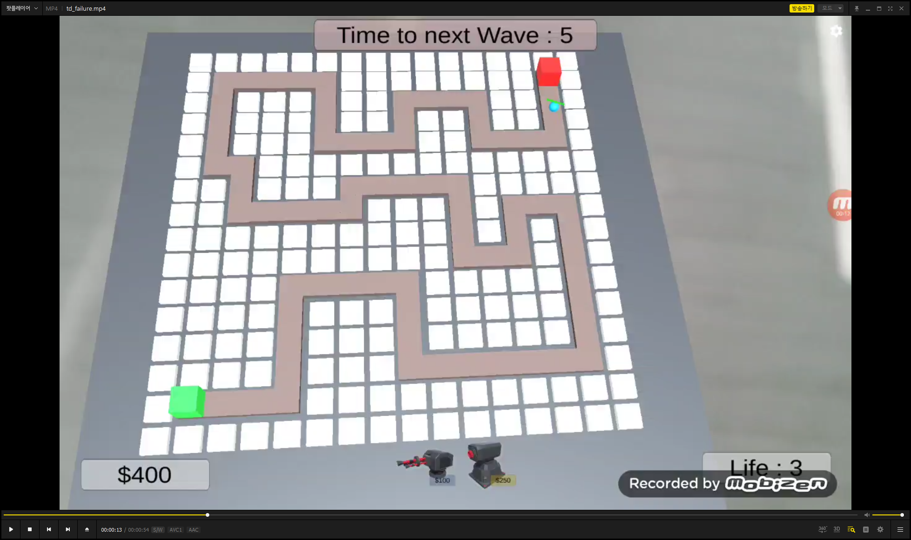
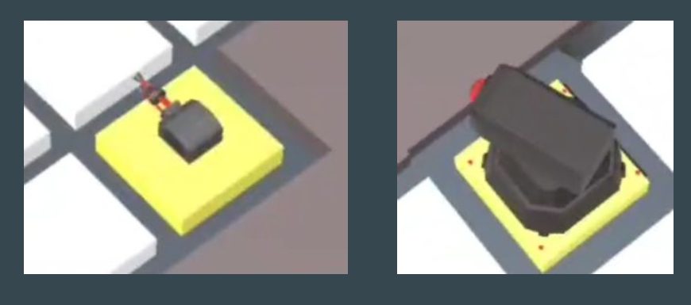
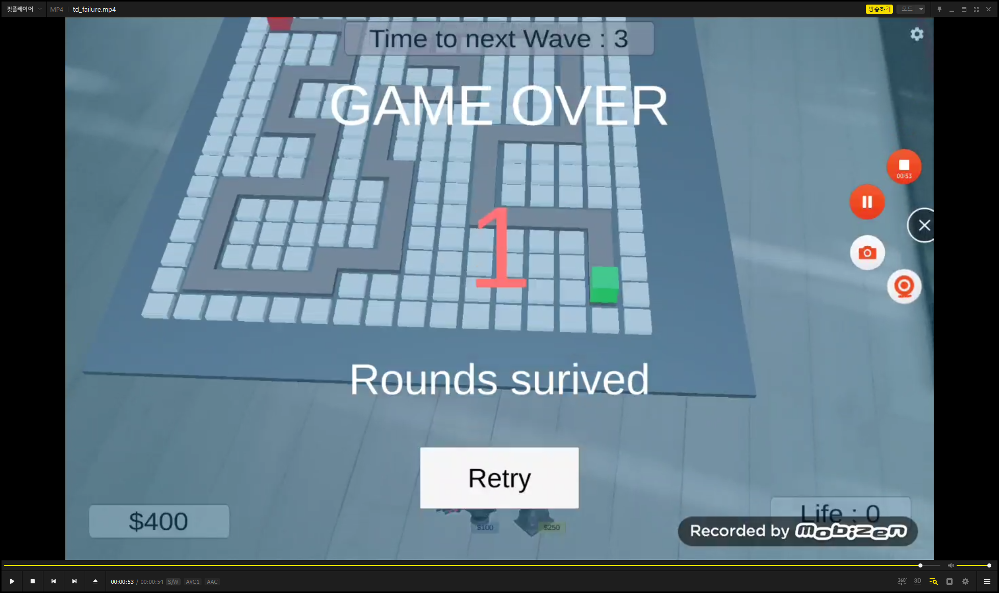

[Unity] AR 타워 디펜스 게임
---
* 게임 종류 : 타워 디펜스
* 구현 방식 : AR (google ARCore)
* playable device : mobile

### 게임 설명
---
간단한 AR 타워 디펜스 게임이다.
에셋과 스크립트 로직은 `brackeys` 유튜버의 유튜브 강의를 참고하였다.

https://www.youtube.com/playlist?list=PLPV2KyIb3jR4u5jX8za5iU1cqnQPmbzG0

시연 동영상은 다음 링크를 참고한다.

https://docs.google.com/file/d/1Ntu2qOab0b_r6rXwNwC7aYHO5OvZbO8Q/preview
https://docs.google.com/file/d/11l0e9LYb6twvC60PHlUzIWcn2RewHdzn/preview

처음 apk를 구동하게 되면 현실 세계의 평면을 인식하는 프로세스가 구동되며 평면이 인식된다면 아래 이미지와 같이 인식된 평면 주위에 렌더링이 된다. 이는 타워 디펜스 맵을 어느 평면에 둘지 정하기 위해서다.

어느 평면을 선택하여 클릭하면 해당 평면 위에 타워 디펜스 맵이 놓이게 된다. 

빨간색 정육면체는 적이 스폰되는 위치를 나타내며, 초록색 정육면체에 스폰된 적이 닿게 된다면 스폰된 적이 사라짐과 함께 `Life`도 깎이게 된다.

만들고 싶은 터렛 버튼을 클릭한 후(하단 중앙 UI), 평면 위에 만들어진 타워 디펜스 맵의 한 타일을 클릭하면 해당 타일은 노란색으로 바뀌며, 해당 타일 위에 터렛이 지어지게 된다.

### UI 설명

---

UI 설명은 두번째 이미지 기준으로 다음과 같다. 

* 상단 중앙의 `Time to next Wave` : 다음 웨이브까지 남은 시간(초 단위)
* 하단 좌측의 `$400` : 현재 소유중인 돈
* 하단 중앙의 `터렛 / 미사일 터렛 아이콘` : 구매 / 배치 가능한 터렛 종류
    * 터렛마다 가격이 정해져 있음
        * 터렛 : `$100`, 미사일 터렛 : `$250`
    * 소유중인 돈을 넘지 않는 한도 내에서 터렛 구매 / 배치 가능
* 하단 우측의 `Life` : 현재 남은 목숨 수
    * 적들이 초록색 정육면체에 닿게 되면 목숨이 하나씩 차감됨
    * 0이 되면 게임 오버

스폰되는 적은 색깔에 따라 구분되게 하였으며, 기본적으로 구의 형태를 띈다. 초록색, 노란색, 빨간색 구로 갈수록 HP가 많고 맵을 통과하는 속도가 빠르다. 스폰되는 순서도 초록색부터 빨간색으로 갈수록 늦게 나오게 된다. 
게임 승리 조건은 가장 마지막에 나오는 빨간색 구 무리까지 `Life`가 0이 되지 않고 해치우면 승리, 아니면 패배가 된다.

* 승리 화면

* 패배 화면

### 게임 / 프로젝트의 한계

* 프로젝트 hierarchy 구조가 개판이다.
    * google ARcore를 사용하는 것에 낯선 관계로 sample scene 환경 위에서 작업하였다.
    * 스크립트를 포함한 주요 파일은 `Assets\GoogleARCore-original\Examples\HelloAR` 안에 존재한다.
* 사운드 이펙트가 없다.
* 터렛 추가는 되나 이미 추가한 터렛에 대해서는 삭제가 불가능하다.
* 승리 / 패배 화면에서 나오는 `Retry` 버튼이 생각하는 대로 작동을 하지 않을 수 있다.
    * 물론 Retry 버튼을 누르면 다시 시작하는 logic을 짜려 했으나.. ARcore 때문인지 꼬여서 아마 작동하지 않을 것이다. 
    작동을 하지 않는다면 release에 첨부한 `.apk` 파일을 재실행을 하여야 한다.

